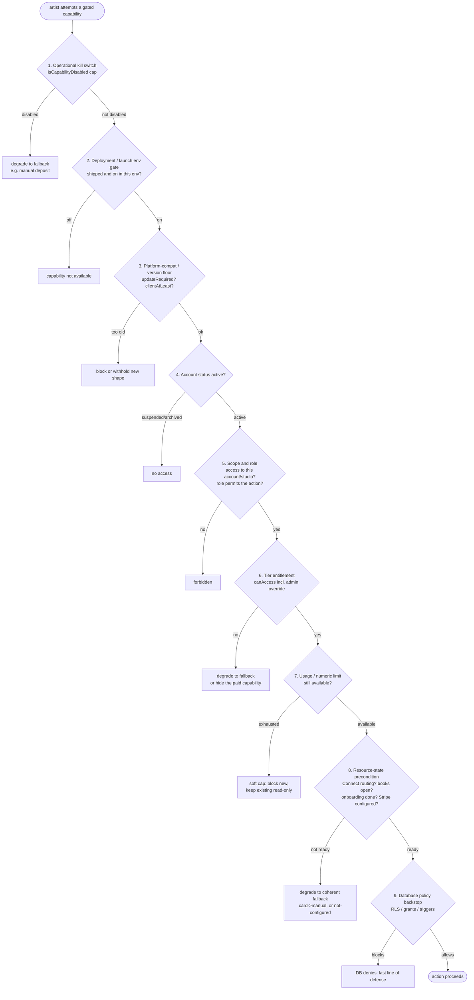

# Account access decision tree

**Status:** System definition, 2026-07-23 (roadmap slice BM-2.0). Companion to `docs/product/account-and-entitlement-system.md`. Documents the exact runtime access-resolution order for any gated capability, challenges the naive order, and states the recommended one.

Conventions: sentence case, no em-dashes.

---

## 1. What this resolves

For any capability an artist tries to use (request a card deposit, edit an email template, create a trip beyond a cap, host a guest spot, sell goods), the system must answer one question: **is this action allowed right now, and if not, does it degrade or does it error?** This document is the ordered set of checks that produces that answer, and the reason for the order.

The single most important design principle, already true for the one enforced gate today: **the innermost server layer is authoritative, and where a coherent fallback exists the action degrades rather than errors.** A free artist requesting a card deposit does not see an error; they get a manual deposit. That degrade-not-error posture is the model.

---

## 2. The naive order (the prompt's suggestion), and why it needs adjusting

The prompt proposes:

1. Is the account active and allowed to use Inklee?
2. Is the feature available on the current platform and app version?
3. Is the feature operationally enabled?
4. Does the user have access to the relevant account or studio?
5. Does the user's role permit the requested action?
6. Does the account have the required entitlement?
7. Is the relevant usage limit still available?
8. Is an administrative or beta override present?
9. Does the database policy independently allow the operation?

This is close, but three adjustments make it correct for Inklee:

- **The operational kill switch must come first, not third.** An incident pause has to beat everything, including a paid entitlement and an active account. If deposits are paused platform-wide because of a Stripe incident, a Plus artist with an active account must still fall to manual. Putting account-active before the kill switch would let a paid entitlement override an incident pause, which is exactly wrong. The kill switch is fail-open (unset means pass), so it is cheap and safe to check first.
- **The administrative or beta override is not a separate step.** In the built engine the per-feature override lives inside `canAccess` and already wins both ways over the plan baseline (`packages/shared/src/entitlements.ts:63-70`). Making it a separate late step would duplicate logic and risk the two disagreeing. It folds into the entitlement check.
- **The resource-state precondition (Connect routing, books open, onboarding complete) is a distinct final stage**, because it decides degrade-vs-error, not allow-vs-deny. It is not in the naive list at all, but it is where the card-vs-manual and card-vs-not-configured branches actually happen.

---

## 3. The recommended resolution order

Evaluate in this order. First failure wins. Cheapest and most authoritative first. This composes all six control axes coherently.



### Step-by-step, with the concrete mechanisms

1. **Operational kill switch.** `isCapabilityDisabled(cap)` reading `DISABLED_CAPABILITIES` (`apps/web/src/lib/server/app-config.ts:28`). Fail-open. Registered capabilities today: `deposits`, `instagram_import`. An incident pause beats a paid entitlement. Where a fallback exists (deposits to manual), degrade; otherwise return the capability-disabled error.
2. **Deployment or launch env gate.** Fail-closed. Examples: `tattooMapEnabled()`, `isGoodsCommerceEnabled()`, `CHECKOUT_ADDONS_PROD_READY`, `AUTOMATED_SEED_IMPORT_ENABLED`, `EMAIL_LIFECYCLE_ENABLED`. There is no point checking an account's entitlement to a feature that is not deployed. Re-checked server-side on every gated action (defense in depth), never trusted from the client `NEXT_PUBLIC_` read alone.
3. **Platform-compat and version floor.** `updateRequired` (from `MOBILE_MIN_VERSION*`) blocks an old build entirely; `clientAtLeast()` is the intended per-response tool to withhold new enum values or money shapes from a build that cannot render them. The hard floor is wired; `clientAtLeast` is scaffolding with no production call sites yet, and that is a gap to close before any wire-breaking change ships (a new tier value, a new deposit state).
4. **Account status active.** `profiles.account_status === 'active'`. Today this is enforced via the Supabase auth ban plus public-page filters, not at the action layer. Recommendation: make it an explicit early check on gated actions and in `requireMobileUser`, so a suspended account cannot act with an in-flight token. This closes finding 9 in the audit findings.
5. **Scope and role.** Does the caller have access to the relevant account or studio, and does their role permit the action? Today: artist owns their own data (RLS plus `.eq("artist_id", userId)`), studio owner is `is_studio_owner()` (a single boolean), admin is the env allowlist. When studio membership ships, this becomes `has_studio_capability(user, studio, capability)`. This step is where a studio subscription must not grant unrelated personal entitlements and vice versa; scope is checked before entitlement.
6. **Tier entitlement, including the admin per-feature override.** `canAccess(overrides, feature)` (`packages/shared/src/entitlements.ts:63`). The `entitlement_overrides` boolean already wins both ways inside this call, so the administrative and beta override needs no separate step. This is where the plan tier, the comp, the beta grant, and the grandfather all resolve to a single boolean. For a paid capability with no fallback (branding removal, analytics), a failing entitlement hides or disables the paid capability; for one with a fallback (deposits), it degrades.
7. **Usage or numeric limit.** For features that are not boolean (custom fields, trips, studios, later goods products, IG sync capacity): is the limit still available? A soft cap blocks new creation and keeps existing items read-only, it never deletes. This step does not exist today (all caps are unenforced); it is added by the entitlement extension.
8. **Resource-state precondition.** Can the action physically complete? Connect `routeCharges` (card vs manual), `books_open`, `onboarding_completed`, Stripe or Instagram configured. This decides degrade-vs-error, not allow-vs-deny, and it is where the card-vs-manual branch actually happens (`getConnectRoutingForArtist().routeCharges`). Degrade to the coherent fallback where one exists.
9. **Database policy backstop.** RLS own-row policies, column privileges, service-role-only tables, triggers. This is the last line of defense, not the access model, because the enforced write paths already run as the service role, which bypasses RLS. Its job is to make artist-A-cannot-touch-artist-B and the money-column write-lockdown hold even against a hand-crafted PostgREST call.

Role permission for the admin operator surface is orthogonal to all of the above. It gates operator routes (`requireAdmin` / `getAdminId`, fail-closed AAL2), not artist capabilities, and sits before everything on admin routes only.

---

## 4. The current worked example (deposits)

The one fully implemented gate composes four of these steps into one boolean, and it is the template for every future gate:

```
// apps/web/src/lib/server/bookings.ts, requestDepositCore
depositsEntitled =
    !isCapabilityDisabled("deposits")        // step 1: kill switch
    && canAccess(overrides, "deposits");     // step 6: entitlement (+ admin override folded in)

// card vs manual branch:
routeCharges = getConnectRoutingForArtist(artistId).routeCharges;  // step 8: resource state
// step 9 backstop: only service role can write the deposit columns (migration 0074 lockdown)
```

An un-entitled or capability-paused or un-routable artist degrades to a manual deposit. No error, no data loss, no mislead (on web). The mobile client must be brought to consult the same combined result (audit finding S1), ideally via one server-computed "will route to card" predictor so the three factors can never drift again.

---

## 5. Fallback catalogue (degrade-vs-error per capability)

| Capability | On fail | Fallback |
| --- | --- | --- |
| Card deposit | kill switch, entitlement, or Connect not ready | manual deposit (no PaymentIntent), UI must say so before the artist sends |
| Goods add-on checkout | env park, entitlement, or Connect not ready | deposit-only checkout, silently |
| Branding removal (Plus) | entitlement | show the default footer |
| Custom email templates (Plus) | entitlement | use the default template (emails always send) |
| Custom fields beyond cap (Plus) | limit | block new, keep existing read-only |
| Trips or studios beyond cap (Plus) | limit | block new, keep existing read-only |
| Analytics (Plus) | entitlement | hide the paid analytics surface, keep the free dashboard |
| Instagram import | kill switch or config | manual upload |
| Map and studio features | env flag off | `notFound()` |
| Any action | account suspended | no access |

The rule: never error a booking-safety or trust flow (deposits always work as manual, emails always send, reminders always fire). Paywalls degrade or hide; they do not break the artist's ability to run their books.

---

## 6. What must never be the security boundary

- Navigation visibility (`nav-config.ts` conditionals).
- Disabled buttons or hidden UI.
- Client-side capability hides (`useCapability` on mobile).
- A `NEXT_PUBLIC_` env read in a client component.
- The mobile plan pill or `canCollectDeposits` field (cosmetic).
- The edge proxy AAL check (fails open by design).

Every one of these may be duplicated for user experience, but the authoritative check is always the server core, the API route, the webhook signature, or the DB backstop. This is already the codebase's discipline for `deposits`; the extension must hold every new gate to the same standard.
