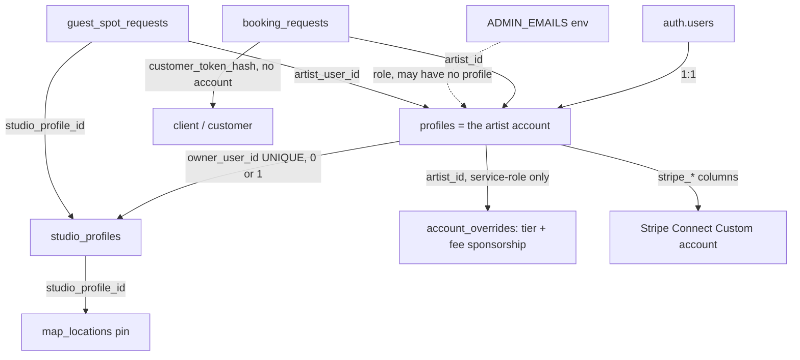
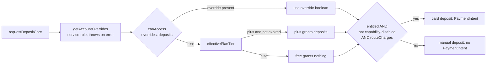
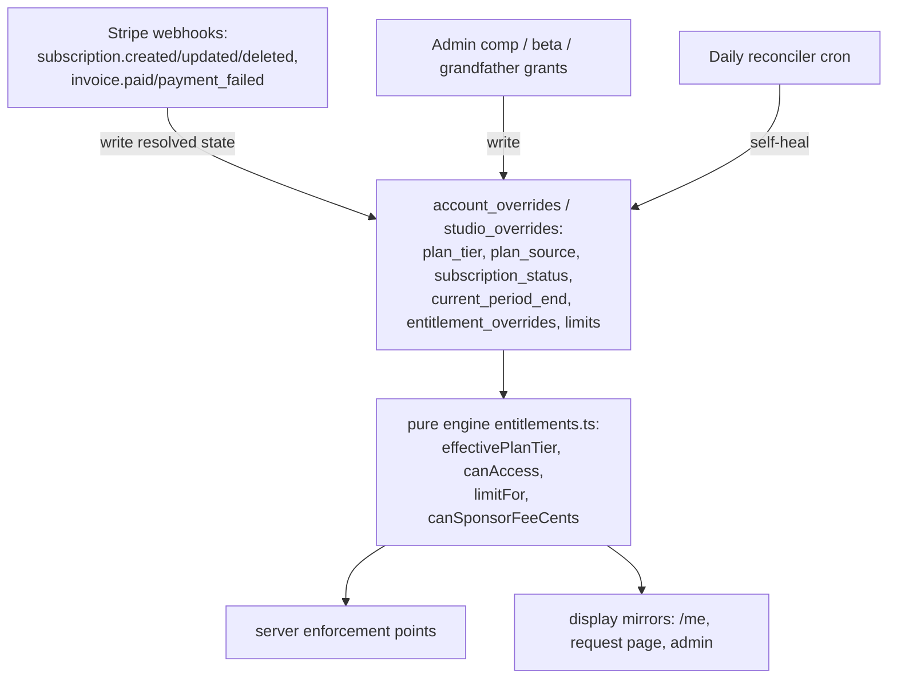

# Account and entitlement system

**Status:** Audit and system definition, 2026-07-23 (roadmap slice BM-2.0). Design input for BM-2.2 onward. No production migration or pricing change was performed by this work.

**Purpose:** The single source of truth for how Inklee represents accounts, identities, roles, billing tiers, subscription state, entitlements, feature flags, and administrative overrides, and the target model that every future feature is assigned against. Companion documents:

- `docs/product/account-tier-feature-matrix.md` (per-feature tier and entitlement matrix)
- `docs/product/account-access-decision-tree.md` (runtime access resolution order)
- `docs/product/account-tier-audit-findings.md` (repository-grounded findings)
- `docs/product/account-tier-migration-plan.md` (phased plan, not yet executed)
- `docs/product/account-tier-business-model-map.md` (business model to entitlement mapping)
- `docs/product/account-tier-unit-economics-inputs.md` (data needed to validate pricing)

Strategy and pricing direction live in `docs/business-model.md`; the artist account and payout description in `docs/artist-account-and-payouts.md`; the money and legal framing in `docs/payment-flow-for-counsel.md`.

This document uses sentence case and no em-dashes per the repository documentation conventions.

---

## 1. Executive summary

Inklee's account model is simpler than the founder documents imply, and the parts that exist are well built. There is exactly one account type (the artist), three cleanly separated state axes (account status, entitlement, payout), and a real, pure entitlement engine shipped in Slice 81. The architecture is already the correct shape for a tier system. The gaps are not architectural; they are coverage and commercial:

1. Only one of six declared entitlement features is actually enforced (`deposits`). The other five are inert placeholders.
2. There is no subscription billing. Every tier is granted by an admin as a comp. `plan_source = 'paid'` is a label with no purchase behind it.
3. There are two parallel, disconnected paywall systems (the `account_overrides` entitlement engine and the older `profiles.settings.features` flags), and goods rides the older one.
4. There is no studio billing entity, no membership or seat table. A per-studio tier has nowhere to attach an entitlement today.
5. The documented economic premise, that gating card deposits behind Plus makes every deposit-taking artist a paying subscriber, does not hold at launch, because Plus is comped.

The recommendation is to **preserve and extend the existing entitlement architecture, not rebuild it**, and to fill the five gaps above in a specific order that does not break production and does not require a broad migration first.

The target model keeps ten concepts distinct (identity, account type, membership, role, billing tier, subscription state, entitlement, feature flag, administrative override, lifecycle state) and never collapses them into a single `plan`, `role`, or `isPro` field. The current code already avoids that collapse for the axes it has; the work is to add the missing axes (subscription state, studio scope, numeric limits) with the same discipline.

---

## 2. Current state

### 2.1 Account model

There is **one account type: the artist**. One `auth.users` row maps 1:1 to one `profiles` row (`profiles.id` is the primary key and the foreign key to the auth user, `apps/web/src/db/schema.ts:54`). There is no `users` vs `artists` split, no `role` column, no membership, staff, or seat table, and no superadmin distinct from admin.

Everything that looks like a separate identity is one of: a relationship anchored on an artist account, a role derived at request time, or a contextual state stored as columns on the account.

| Identity | Stored where | Auth mechanism | Class |
| --- | --- | --- | --- |
| Anonymous visitor | nowhere | none (ambient anon role) | not an identity |
| Authenticated artist | `auth.users` + `profiles` (1:1) | web: Supabase SSR cookie session; mobile: `Authorization: Bearer <token>` (`apps/web/src/lib/server/mobile-auth.ts`) | **the only account** |
| Studio owner | `studio_profiles.owner_user_id` (UNIQUE, migration 0078) | same artist session; ownership check `is_studio_owner()` | relationship on the artist account |
| Admin | `ADMIN_EMAILS` env, no DB row (may lack a profile) | cookie session + email allowlist + AAL2 MFA (`apps/web/src/lib/admin-guard.ts`) | role, orthogonal to the account |
| Customer / client | fields on `booking_requests` (email, handle, token hash) | sha256 magic-link token, 30 day expiry, one-time edit links | relationship, per booking |
| Claimant | `location_claims.claimant_role` (per-claim, migration 0075) | artist session; service-role insert | relationship state on a claim |
| Service role | server-only key | `SUPABASE_SERVICE_ROLE_KEY`, bypasses RLS | infrastructure principal, not a user |

Contextual states carried on the artist account (not identities): `account_status` (migration 0020), `is_tester` (analytics only, migration 0021), the entitlement tier in `account_overrides` (migration 0045), the Stripe payout columns (migration 0039), map presence `map_visibility` (migration 0076), and MFA assurance.



### 2.2 Authentication model

- **Web**: Supabase SSR cookie session (`apps/web/src/lib/supabase/server.ts`), gated at the edge by `apps/web/src/proxy.ts` (note: the middleware file is `proxy.ts` exporting `proxy`, not `middleware.ts`). `ARTIST_PATHS` redirect to `/login` when unauthenticated, to `/auth/mfa` when an MFA step-up is due, and to `/onboarding/welcome` when no profile exists.
- **Mobile**: `Authorization: Bearer <access token>`. `requireMobileUser(req)` builds a per-request Supabase client with the anon key plus that token, so RLS applies as the signed-in artist, never the service-role key (`apps/web/src/lib/server/mobile-auth.ts:28-58`). Same identity, different transport. Mobile API base must be `inklee.app`, because the `inkl.ee` apex 308-redirects and drops the `Authorization` header across origins.
- **Admin**: `ADMIN_EMAILS` allowlist plus an AAL2 MFA step-up that fails closed (`apps/web/src/lib/admin-guard.ts`). The proxy adds a defense-in-depth edge redirect for `/admin` that fails open; the authoritative check is in `admin-guard.ts` and every admin action re-checks.
- **Client**: no account. A sha256 magic-link token on `booking_requests`, 30 day expiry, one-time edit links that rotate on use.

### 2.3 Role and permission model

There is no role or permission table. The three effective roles are:

1. **Artist**: owns their own `profiles` row and all `artist_id`-scoped data. Enforced by RLS own-row policies plus explicit `.eq("artist_id", userId)` scoping in server cores.
2. **Studio owner**: `studio_profiles.owner_user_id = auth.uid()`, one studio per owner, checked by `is_studio_owner()` (a `security definer` boolean helper, migration 0078). Ownership is a single boolean with no gradations. The claimant role captured at claim time (`artist | receptionist | manager | business_owner`) is decorative and confers no differentiated access after approval.
3. **Admin**: env allowlist plus AAL2, all-or-nothing. There is no read-only admin, support agent, or moderator tier; every admin gets the full service-role-backed surface behind one gate.

### 2.4 Billing model

There is no billing. The complete verified Stripe surface (`apps/web/src/lib/stripe-connect.ts`, `apps/web/src/lib/server/bookings.ts`, `apps/web/src/app/api/stripe/webhook/route.ts`) is:

- Connect Custom accounts (one per artist, `requirement_collection: application`, `fees.payer: application`, `losses.payments: application`).
- One-time guest PaymentIntents for deposits (destination charge, `on_behalf_of` + `transfer_data.destination`, `application_fee_amount` = the 3% platform fee, single-sourced in `apps/web/src/lib/platform-fee.ts`).
- Refunds (full only, `reverse_transfer: true` + `refund_application_fee: true`).
- Identity document upload files.

There is **no Stripe Customer, Subscription, Checkout Session, Billing Portal, Invoice, Price, or Product** anywhere in `apps/web`, `apps/mobile`, or `packages/shared` (grep-confirmed; the only matches are in skill reference docs). There are **no hardcoded Stripe object ids** in application source. Only three `STRIPE_` env vars exist: `STRIPE_SECRET_KEY`, `STRIPE_WEBHOOK_SECRET`, `NEXT_PUBLIC_STRIPE_PUBLISHABLE_KEY`.

The one live monetization is the 3% deposit fee, and it has never charged a real transaction (launch gate G-5 is unrun, zero live Connect accounts). Fee sponsorship (`account_overrides.fee_sponsored*`, migrations 0058/0099/0100) lets Inklee waive its own 3% for comped artists; it is the most mature money-model code in the repo and is the template for how a metered credit system would work.

### 2.5 Feature access model (the entitlement engine, Slice 81)

Three cleanly separated layers:

1. **Pure engine** `packages/shared/src/entitlements.ts` (no DB import, safe for client bundles), re-exported by `apps/web/src/lib/entitlements.ts`.
2. **Server read** `apps/web/src/lib/entitlements-server.ts::getAccountOverrides(artistId)`, a service-role `maybeSingle()` that throws on query error by design (a swallowed error would resolve a comped artist to free and silently downgrade a card deposit to manual).
3. **Storage** `account_overrides` (migration 0045), RLS enabled with zero policies, so it is service-role only and an artist can never read their own tier, notes, or budget.

Types and resolution:

- `PlanTier = 'free' | 'plus'`. No `studio` value.
- `ENTITLEMENT_FEATURES = [deposits, branding, custom_templates, extra_fields, extra_trips, analytics]`.
- `PLAN_FEATURES`: `free` grants none, `plus` grants all six.
- `canAccess(o, feature)`: an explicit per-feature override in `entitlementOverrides` wins in both directions; otherwise the effective plan baseline. `effectivePlanTier` lapses an expired comp to free lazily at read time (nothing sweeps `plan_expires_at`).

**Only `deposits` is enforced.** A repo-wide grep confirms the other five feature literals appear only in the definition and the admin panel labels; nothing passes them to `canAccess`. The single authoritative gate is in `requestDepositCore` (`apps/web/src/lib/server/bookings.ts:850-851`):

```
depositsEntitled = !isCapabilityDisabled("deposits") && canAccess(overrides, "deposits")
```

An un-entitled artist falls through to a manual deposit. The card path additionally requires Connect routing (`routeCharges`). All other call sites (`/api/mobile/me`, the request detail page, the admin panel) are display-only mirrors.



### 2.6 Feature-flag model

There are six distinct control axes, routinely conflated. Full inventory in `docs/product/account-tier-audit-findings.md`.

| Axis | Question | Scope | Store | Fail direction |
| --- | --- | --- | --- | --- |
| Tier entitlement | Is this account allowed this feature? | per-artist | `account_overrides` | fail-soft (degrade) |
| Per-artist product toggle | Has this artist enabled this module? | per-artist | `profiles.settings.features` (`apps/web/src/lib/features.ts`) | default-on, effectively unused as a gate |
| Deployment / launch env gate | Is this feature shipped or on in this environment? | platform | Vercel env var | fail-closed |
| Operational kill switch | Is this live capability paused right now? | platform | `DISABLED_CAPABILITIES` env, `isCapabilityDisabled()` | fail-open |
| Platform-compat / version floor | Can this client build consume this safely? | per mobile build | `MOBILE_*` env + `clientAtLeast()` | fail-open |
| Role permission | Is this human an operator? | per-email | `ADMIN_EMAILS` + AAL2 | fail-closed |

There is no Firebase Remote Config, no OTA, no percentage rollout, and no beta-cohort table, by deliberate documented decision (`docs/architecture/remote-config-plan.md`, `docs/architecture/capability-registry.md`).

### 2.7 Studio and membership model

`studio_profiles` (migration 0078) is a one-studio-per-owner public map and guest-spot-host profile from the Inklee 2.0 track. It is not a multi-tenant booking entity. Verified facts:

- One studio per owner, one owner per studio, DB-enforced by `studio_profiles_one_per_owner UNIQUE (owner_user_id)`.
- **No membership, staff, seat, or roster table exists.** It was designed in the schema proposal and deferred by founder decision. Trust the migrations, not the proposal.
- Guest artists get no account elevation. A confirmed guest-spot stay grants read access to the studio welcome pack and materializes a personal trip leg; nothing more.
- Studios hold no client bookings and no client records. Client booking (`booking_requests`) is keyed to the individual artist.
- The studio survives its owner: `owner_user_id ON DELETE SET NULL` plus a `studio_detach_on_owner_loss` trigger that suspends the studio and unclaims the map pin.
- There is no studio-deletion path and no studio-media purge routine.
- Studio has no mobile surface; the owner cockpit is web-only.
- Nobody pays for a studio today.

### 2.8 Client identity model

Clients have no account, by locked decision (`DECISIONS.md`, customer accounts rejected). A client is `customer_email` plus a sha256 magic-link token on `booking_requests`. If the same human later signs up as an artist, there is no linkage between their client bookings and their artist profile; email is not a join key across the two planes.

### 2.9 Administrative access model

Admin is `ADMIN_EMAILS` plus AAL2 MFA, enforced by `requireAdmin()` (pages) and `getAdminId()` (actions), both fail-closed, defense-in-depth at the edge and re-checked per surface. Admin writes run through the service role and are double-logged to `admin_action_log` and `audit_log`. There is no DB admin role; a leaked service-role key is equivalent to full admin. The seed and coverage admin routes are the exception: they authenticate with `CRON_SECRET`, not the admin allowlist, so "admin" in the URL does not always mean admin-email-gated.

---

## 3. The three axes today, and why they are a strength

An artist account is described by three states that are easy to confuse. Confusing them cost a day of debugging during the first live money test (documented in `docs/artist-account-and-payouts.md`).

| Axis | Stored in | Question |
| --- | --- | --- |
| Account status | `profiles.account_status` | Is this account active, suspended, or archived? |
| Entitlement | `account_overrides` (tier + per-feature overrides) | Is this artist allowed a given feature? |
| Payout | `profiles.stripe_*` | Can Stripe route a charge to them? |

An artist can be entitled but unroutable, or routable but unentitled. Either way a deposit request quietly becomes manual, which is correct product behavior. **This separation is the model's biggest existing strength and the target model preserves it.** The target adds two axes with the same discipline: subscription state (independent of tier) and scope (per-artist vs per-studio).

---

## 4. Identified inconsistencies and risks

Detailed and cited in `docs/product/account-tier-audit-findings.md`. The load-bearing ones:

1. **Five of six entitlements are inert.** Granting or revoking `branding`, `custom_templates`, `extra_fields`, `extra_trips`, `analytics` in the admin panel changes nothing in product behavior. Any tiering built on them today would be UI-only or absent.
2. **Two disconnected paywall systems.** `account_overrides` (Slice 81) and `profiles.settings.features` (Slice 76, all default on, never written off). Goods rides the older one. "What does Plus gate" has two half-answers.
3. **No self-serve tier path.** Every tier change is a manual admin upsert into `account_overrides`. `plan_source = 'paid'` exists as a value but nothing writes it from a purchase.
4. **The documented economic premise does not hold at launch.** Deposits are entitlement-gated, but the entitlement is comped, so at launch every Plus account is free, the subscription does not offset the ~2 euro per month Custom-account cost, and Inklee carries the loss-making small-deposit and refund exposure with zero subscription revenue.
5. **Mobile card-vs-manual predictor drift.** `apps/mobile/src/components/booking/BookingActions.tsx:373-374` predicts card-vs-manual from capability plus Connect routing only, omitting `canAccess(overrides, "deposits")`. The moment a real paid tier ships (a free artist connects Stripe but has not paid), mobile will tell them the client pays by card and quote a fee, while the server issues a manual deposit. This is the exact "told card, got manual" failure the money-path rules forbid.
6. **`account_status` is not an independent gate.** The real suspension enforcement is the Supabase auth ban (`ban_duration`); the column is a mirror plus a public-page filter and is not checked in the proxy, mobile auth, or RLS. The two can diverge (migration 0074 calls this out).
7. **PlanTier widening footgun.** An unknown tier resolves to free (`effectivePlanTier`). A future `studio` value silently downgrades on old mobile builds that cannot render it.
8. **No studio-scoped entitlement holder.** `account_overrides` is keyed by `artist_id`. A per-studio tier has nowhere to attach.
9. **No plan-change history, no conversion events, no margin actuals.** The only durable record of a tier grant is the admin action log. The "3% is the margin" thesis has no stored fee and no Stripe cost, so it cannot be validated against actuals.
10. **Entitlement has zero DB representation.** The guarantee that free artists do not get card deposits is one `canAccess` call plus the DB fact that clients cannot write deposit columns. There is no DB tripwire; a new code path that writes deposit state or forgets the check silently bypasses the tier.

---

## 5. Proposed normalized domain model

Keep these ten concepts explicitly distinct. Never collapse them into one `plan`, `role`, or `isPro`.

| # | Concept | Today | Target |
| --- | --- | --- | --- |
| 1 | Identity | one auth user = one artist | unchanged; clients tokenized, admins env-allowlisted |
| 2 | Account type | artist only | still one account type; studio and shop are capabilities and owned entities on an artist account, not new account types |
| 3 | Membership | none | RATIFIED (D3, 2026-07-23): `studio_memberships` (user to studio; role own / administer / join / visit; multi-studio; bilateral-consent FSM). Greenfield storage, built when studios ship; not needed for Plus |
| 4 | Role | implicit (artist owns own; studio owner; admin env) | studio roles via membership later; keep roles independent from billing tier |
| 5 | Billing tier | `free`, `plus` | add `studio` later; keep tier a resolved value, not the enforcement key |
| 6 | Subscription state | none (comp only) | new axis: `none / trialing / active / past_due / canceled / expired`, populated by Stripe webhooks, independent of tier |
| 7 | Entitlement | `canAccess`, only `deposits` enforced | extend: wire the five dead features, add numeric limits (not only booleans), reconcile `features.ts` into it |
| 8 | Feature flag | six axes | keep distinct from entitlements; document one resolution order |
| 9 | Administrative override | `entitlement_overrides` jsonb (per-feature both ways) | keep; add source labels for beta and grandfather |
| 10 | Lifecycle state | `account_status`, `plan_source`, `plan_expires_at` | add `subscription_status`, `plan_source in (comp, paid, store, grandfathered, beta)`, keep `account_status` |

### 5.1 Scope

Entitlements belong to a **scope**, not always to a person. Today scope is implicit (always the artist). The target makes scope explicit:

- **Artist scope**: personal features (deposits, branding, custom templates, caps, analytics). Keyed by `artist_id` in `account_overrides`. This is everything shipped.
- **Studio scope**: organization features (studio profile, guest-spot hosting, later multi-artist booking). A studio subscription must not grant unrelated personal entitlements, and an artist's personal subscription must not grant studio-wide permissions. Personal and studio subscriptions, data ownership, roles, and entitlements stay separate: they resolve against separate holders through the same engine. When the Studio tier ships, add a studio-scoped entitlement holder keyed by `studio_profile_id`; a user resolves personal entitlements from their own `account_overrides` and studio entitlements from each studio they belong to.

### 5.2 Account type stays singular on purpose (ratified D3, 2026-07-23)

Founder-ratified D3: **a studio is a separate organization and entitlement scope reached through individual user accounts. It is not a separate authenticated account type.** A user can own, administer, join, or temporarily visit one or more studios through studio memberships. Personal and studio subscriptions, data ownership, roles, and entitlements remain separate.

Consequences for the model: keep one account type (the artist login); model the studio as an owned organization entity plus a scope, layered on individual user accounts, which keeps auth, onboarding, RLS, and the mobile bearer path unchanged. The current `studio_profiles.owner_user_id UNIQUE` (one studio per owner) is a starting constraint that the membership model supersedes: multi-studio ownership and membership are the ratified target, so the future `studio_memberships` table carries the ownership relationship with a role (own / administer / join / visit) and the one-per-owner unique constraint is relaxed as part of that build (migration plan Phase 6+). The engine's `EntitlementScope` type (`personal` vs `studio`) is already shaped for this (BM-2.0 slice 1a).

---

## 6. Proposed entitlement-resolution model

Keep the current hybrid (Option C, below) and make it the single source of truth. Access resolves from an internal row; Stripe updates that row via webhooks; `canAccess` never touches Stripe.



Resolution order for any gated capability (challenged and finalized in `docs/product/account-access-decision-tree.md`):

1. Operational kill switch (`isCapabilityDisabled`), fail-open, beats everything including a paid entitlement.
2. Deployment or launch env gate, fail-closed.
3. Platform-compat or version floor.
4. Account status active.
5. Scope and role: does the caller have access to the relevant account or studio, and does their role permit the action?
6. Tier entitlement, including the admin per-feature override (which already wins both ways inside `canAccess`).
7. Usage or numeric limit still available.
8. Resource-state precondition (Connect routing, books open, onboarding complete), degrade to the coherent fallback where one exists.
9. Database policy independently allows the operation (backstop).

### 6.1 Entitlement architecture options evaluated

- **Option A, static tier-to-feature map.** This is `PLAN_FEATURES` today. Simple, but cannot express comps, beta, grandfathering, or support exceptions.
- **Option B, database-backed per-account entitlements.** This is `entitlement_overrides` today. Flexible, but verbose if every account carries a full explicit set.
- **Option C, hybrid: tier defaults plus per-account overrides.** This is exactly what `account_overrides` plus `entitlements.ts` already implement.

**Recommendation: Option C, which is already built.** Validate it and extend it. The tier gives defaults; overrides handle comp, beta, grandfather, and support exceptions. Operational complexity is low (one service-role table plus a pure engine), billing consistency is high (an internal row reconciled with Stripe rather than live Stripe checks), query cost is a single indexed lookup, caching is unnecessary (and undesirable, because a just-granted comp must take effect immediately), offline mobile behavior is safe (enforcement is server-side; the client field is cosmetic), migration effort is additive, and long-term maintainability is good because the pure engine is the one place tier-to-feature logic lives.

The three extensions Option C needs: (a) numeric limits, not just booleans; (b) a `subscription_status` axis and a Stripe reconciler that writes the resolved `plan_tier`; (c) a studio scope for the Studio tier.

---

## 7. Proposed tier definitions

Prefer the smallest coherent set: Free, Plus, Studio. Add-ons and transaction fees are separate from tiers.

### 7.1 Free

The complete core booking workflow, genuinely useful, the front door and the trial. Strategic purpose: acquisition, activation, network supply, and the funnel to paid conversion. Includes (all shipped and free today): public booking page, structured form plus custom fields, the request FSM (accept, pass, cancel, reopen), calendar and manual appointments, waitlist, books open/closed plus cap plus slots, manual deposit tracking, client history and notes, automated reminders, transactional and editable email templates, flash designs plus Instagram import, the bio/Linklee hub, the trip planner, map browsing, and guest-spot requests. Soft caps (fields, trips, studios) may be introduced with generous free numbers that never block a first booking, with the overflow gated to Plus.

### 7.2 Plus (approximately 3 euro per month)

The artist-leverage tier. The paying entity is the solo artist. The pricing metric is a flat per-account monthly or yearly subscription. Includes: in-app card deposit collection (the one enforced gate today, the 2.75 euro net margin per deposit that offsets the ~2 euro per month Custom-account cost), removal of the "Powered by inklee" footer, full custom email-template editing, higher caps on custom fields, trips, and studios, lightweight personal analytics, reminder customization, and native goods appointment add-ons plus inventory. All of these except deposits are currently free and unenforced; wiring them is the substance of BM-3.

### 7.3 Studio (approximately 25 euro per month, later)

Organization-level value. The paying entity is the studio owner (a single artist profile until an org entity exists). The pricing metric is a flat per-studio subscription, not per-seat initially. Today it means a claimed studio profile with guest-spot hosting, house rules, welcome pack, and a guest timeline. Later it means multi-artist booking (central inbox, shared calendar, per-artist links, studio roles) when the membership model is built. Studio owners are comped during the map bootstrap; when they pay, and whether the vehicle is the Studio tier or a variant, is open question Q8.

### 7.4 Not tiers

- **Featured map placement**: greenfield add-on candidate, claimed studios only, must never hide free pins or gate search, disclosed as "Featured". Not built and not approved.
- **Goods transaction take**: a percentage on goods GMV mirroring the 3% deposit fee. Requires fixing the goods fee gap (the add-on flow updates the intent amount but not `application_fee_amount`, so goods currently settle at 0% take).
- **Instagram sync capacity**: a per-tier sync or import cap is the natural lever if storage or egress becomes material; the global kill switch is the current blunt control.

---

## 8. Proposed role definitions

Roles describe what someone may do inside an account or studio. Keep them independent from billing tiers.

- **Artist (self)**: full control of their own account and data. Exists today implicitly.
- **Studio owner**: full control of one owned studio. Exists today as a single boolean.
- **Studio manager / front-desk (future)**: delegated studio capabilities (for example, accepting guest spots) via `studio_memberships` with a capability set, only when multi-artist studios ship. `is_studio_owner` would become `has_studio_capability(user, studio, capability)`.
- **Admin (operator)**: `ADMIN_EMAILS` plus AAL2, all-or-nothing today. Optional future refinement into read-only, support, and moderator tiers, but this is not required for the tier system and should not be conflated with customer billing.

---

## 9. Proposed subscription states

Model subscription state independently from tier. The tier is what the account gets; the subscription state is why.

| State | Access it should provide |
| --- | --- |
| None | Free. The default for every new artist. |
| Trialing | Full tier access for the trial window. (No trial at launch; Free is the trial.) |
| Active | Full tier access. |
| Past due | Full tier access during a defined grace period (recommend the Stripe smart-retry window), then downgrade. |
| Canceled (before period end) | Full tier access until `current_period_end`, then downgrade to Free. |
| Expired | Free. |
| Complimentary (comp) | Full tier access, `plan_source = 'comp'`, optional `plan_expires_at`. Exists today. |
| Grandfathered | Full tier access at a preserved price, `plan_source = 'grandfathered'`. |
| Beta | Full tier access, `plan_source = 'beta'`, cohort-tracked. |
| Suspended | No access. Enforced by `account_status = 'suspended'` plus the auth ban. |

`plan_source` today is `comp | paid | null`. Extend to `comp | paid | store | grandfathered | beta`. The resolved `plan_tier` stays the entitlement, written by the reconciler from the subscription state so that `canAccess` never learns about Stripe.

---

## 10. Proposed administrative override, beta, grandfathering, and downgrade rules

- **Administrative override**: `entitlement_overrides` already lets an admin grant or revoke any feature in both directions, beating the plan baseline. Keep this. It is the support and exception valve.
- **Beta**: `plan_source = 'beta'` with an optional cohort tag. Beta users get the target tier's full access. This replaces the current practice of comping beta artists to Plus, which is indistinguishable from a paid grant in the data.
- **Grandfathering**: preserve price, not entitlement identity. A grandfathered subscriber keeps their old Stripe Price id and their tier; entitlement keys never change when prices or tier names change. Record `plan_source = 'grandfathered'`.
- **Cancellation and payment failure**: cancellation keeps access until `current_period_end` (Stripe `cancel_at_period_end`), then Free. A failed payment enters `past_due` and keeps access through a defined grace period, then Free. Both are computed from the internal subscription state, not from a live Stripe call.
- **Downgrade behavior**: degrade gracefully. Do not delete data. Existing over-cap items (extra custom fields, extra trips) become read-only rather than being removed, and remain exportable. Card deposits already downgrade cleanly (future requests become manual, already-paid deposits are untouched). Do not paywall access to a user's own existing data without an explicit retention and export policy.

---

## 11. Proposed data-retention behavior on downgrade

- Bookings, clients, flash, trips, and studio content are the artist's data and stay visible, editable, and exportable on downgrade to Free. The GDPR export at `settings/export` already covers profile-scoped data.
- Plus-only formatting (custom email-template wording, removed branding) reverts to the Free default, but the stored content is retained so a re-upgrade restores it.
- Over-cap items become read-only, not deleted.
- Studio-scoped data on a Studio downgrade needs a defined policy (there is no studio-deletion or studio-level export path today; both are gaps to build before selling a churnable Studio tier).

---

## 12. Proposed enforcement layers

The architecture must not rely on hiding frontend UI. For each sensitive capability, the authoritative layer is the innermost one.

| Layer | Role | Authoritative for |
| --- | --- | --- |
| Navigation and UI visibility | user experience only | nothing; never the security boundary |
| Client interaction guards | user experience only | nothing (mobile hides entry points; server enforces) |
| Server actions and API routes / shared cores | the primary boundary | entitlement gates, ownership, FSM transitions (for example `requestDepositCore`) |
| Edge middleware (`proxy.ts`) | defense in depth | login and MFA redirects; fails open, never relied on alone |
| Scheduled jobs (cron) | system operations | `CRON_SECRET`; no user subject |
| Stripe webhooks | money settlement | signature plus metadata cross-check plus atomic conditional update |
| Database functions and RLS | backstop | own-row isolation, column privileges, service-role-only tables |
| Storage policies | backstop | private buckets via signed URLs |

The database is a second line of defense, not the access model, because the enforced write paths already run as the service role, which bypasses RLS. Entitlement enforcement stays in app code (it already fails closed and throws on read error); the DB provides invariant backstops (no client write path to money columns, RPCs locked to service role, unique indexes for caps).

---

## 13. Proposed migration direction

No broad migration now. The direction, detailed and phased in `docs/product/account-tier-migration-plan.md`:

1. Freeze the entitlement vocabulary (keys, limits, scope) and document the resolution order. No schema change.
2. Harden the central resolver: support numeric limits, fix the mobile predictor drift, fix the PlanTier-widening footgun, reconcile `features.ts` into the entitlement engine.
3. Wire server-side enforcement for the five inert features, each with the correct authoritative layer.
4. Add DB and RLS backstops where an invariant is worth enforcing (not a full RLS entitlement gate, which buys little because the write path is already service-role).
5. Integrate frontend and navigation with the wired entitlements.
6. Add subscription billing (Stripe Customer, recurring Price, Checkout or Payment Element, Billing Portal) and the webhook reconciler that writes the internal subscription state.
7. Bring mobile to parity (consume the combined predictor, keep billing web-only).
8. Migrate legacy accounts (comps become explicit `beta` or `grandfathered` sources; no data loss).
9. Add monitoring, conversion events, a plan-change history table, and margin instrumentation.
10. Remove deprecated checks (retire `features.ts` once goods is on the entitlement engine).

---

## 14. Open decisions requiring founder input

Full register in `docs/product/account-tier-audit-findings.md` section on decisions and in each companion document. The load-bearing ones:

1. Do we build subscription billing so Plus is purchasable, or keep comping beta artists and accept the Custom-account cost during beta? (This is the core of the C2 contradiction.)
2. Final tier names and whether the 2.0 studio-owner role is the Studio tier, a separate SKU, a lighter tier, or free during map bootstrap (Q8).
3. Studio pricing metric: flat per-studio or per-seat. Recommendation: flat, to keep it simple and to avoid discouraging collaboration.
4. Whether Plus at approximately 3 euro per month generates enough to justify billing, support, and payment-fee overhead, or whether the transaction fee should carry more of the model.
5. Free-tier soft caps (custom fields, trips, studios): the numbers, and grandfathering for existing over-cap free artists.
6. Whether goods is a Plus entitlement, a transaction-fee-on-all-tiers feature, or both (and fixing the 0% goods take first).
7. Cross-platform billing: keep artist billing web-only (recommended), or build StoreKit and Play Billing.
8. Whether to add a plan-change history table and conversion events now, so comp-to-paid and future self-serve conversions are measurable from day one.

---

## 15. Challenge to this model

Tested against every context the prompt names:

- **Solo artist, free**: unchanged, fully served, no regression. The model is additive.
- **Solo artist, Plus**: the enforced deposits gate plus the newly wired Plus features. Coherent.
- **Multi-artist studio**: not representable today (no membership). The model does not block it: `studio_memberships` plus a studio scope on entitlements slot in without touching the account type. Coherent as a forward path.
- **Guest artist**: needs only a free artist account; the model adds nothing they must buy. Coherent.
- **Seeded and unclaimed studios**: ownerless directory rows, no account, no entitlement. The model leaves them free (network supply) and monetizes only the claimed, owner-run studio. Coherent, and it protects the acquisition funnel.
- **Claimed studio**: an owned entity plus (later) a studio scope. Coherent.
- **Map listings**: outside the entitlement system by design (`map_visibility` is consent, not tier). The model preserves that decoupling. Coherent.
- **Mobile applications**: enforcement is server-side; the client field is cosmetic; billing stays web-only. The one required fix (the predictor drift) is called out. Coherent, with the no-OTA constraint respected.
- **Grandfathered users**: `plan_source = 'grandfathered'`, price preserved, entitlement keys stable. Coherent.
- **Future paid add-ons**: modeled as transaction fees or add-on entitlements, never as new tiers. Coherent, and it keeps the tier set small.
- **International pricing**: the model separates entitlement keys from Stripe Price ids and displayed prices, so per-country and promotional prices change without touching authorization. Coherent.

The one place the model is deliberately incomplete is the studio membership and seat structure, because building it now would violate the "do not overengineer the first production version" and "do not begin a broad migration" constraints, and because Q8 (when and how studios pay) is unresolved. The model reserves the space (scope discriminator, membership table shape) without building it.

Where the current business model and the value architecture do not align, the audit recommends change rather than encoding the assumption: the €3 Plus economics are thin and the launch reality is comp-only, so the audit surfaces that the transaction fee, not the Plus subscription alone, is what actually carries margin at launch, and that building billing is the decision that turns the enforced gate into revenue.
