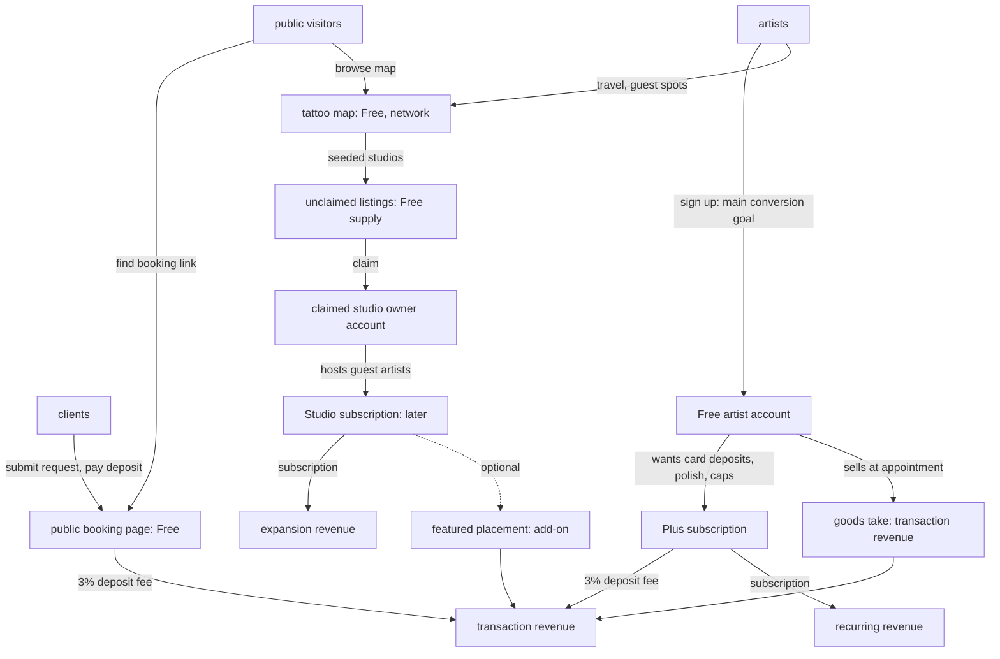

# Account tier business model map

**Status:** System definition, 2026-07-23 (roadmap slice BM-2.0). Companion to `docs/product/account-and-entitlement-system.md`. Connects Inklee's business model to the account and entitlement architecture, grounded in the repository and the strategy documents.

This is analysis and proposal. It does not change strategy. Where implementation evidence suggests a strategic change, it is recorded as a proposal, per the SEO and business-model operating rules. No pricing change was made.

Conventions: sentence case, no em-dashes. Strategy source of truth stays `docs/business-model.md`; this document maps it onto the account system and challenges it.

---

## 1. Current customer segments

From `docs/business-model.md` section 1 and the feature scope, in the founder's priority order:

1. **Solo freelance tattoo artists**, beginner to one to three years professional, Instagram-first. The primary segment.
2. **Traveling and guest-spot artists.**
3. **Small tattoo studios**, later.

The Inklee 2.0 map track adds two account personas: **studio owners** (guest-spot hosts) and **shop owners** (supply shops, unbuilt). **Clients** (people getting tattooed) are explicitly never a customer segment and never have accounts.

## 2. User versus customer

The distinction the account system must encode:

- **Users who receive value but are not expected to pay**: clients (magic-link only), free solo artists, guest artists, and every browser of the map. These are supply and demand for the network, not revenue.
- **Potential paying customers**: the solo artist (for Plus) and the studio owner (for Studio). The paying entity is an artist `profiles` row in both cases today, because there is no separate org billing entity.

The single most important business-model fact from the audit: **the value receiver and the payer are the same person for Plus (the artist) and the same person for Studio (the owner), but the studio's value is organizational.** The account system keeps these as one account type with different scopes, not two account types.

## 3. Paying entities and scope

| Product | Value receiver | Payer | Scope where the entitlement attaches |
| --- | --- | --- | --- |
| Free | solo artist | none | artist |
| Plus | solo artist | the artist | artist (`account_overrides` today) |
| Studio | studio owner and (later) its artists | the studio owner | studio (needs a studio-scoped holder, unbuilt) |
| Deposit fee | artist collects, Inklee earns | client pays | per transaction |
| Goods take | artist sells, Inklee earns | client pays | per transaction |
| Featured placement | studio owner | studio owner | studio (add-on, unbuilt) |

A studio subscription must not grant unrelated personal entitlements, and an artist's personal Plus must not grant studio-wide permissions. Today this is moot (no studio billing), but the target model reserves the scope split so it holds when Studio ships.

## 4. Value proposition by segment

- **Solo free artist**: replace Instagram DMs, Google Forms, and spreadsheets with one booking link, a structured intake, a triage workspace, manual deposit tracking, reminders, and a bio page. Genuinely useful, no upgrade required. Strategic purpose: acquisition, activation, network supply, and the trial.
- **Solo Plus artist**: in-app card deposit collection (the flagship), plus branding control, custom email wording, higher caps, deeper analytics, reminder customization, and goods inventory. The recurring value is automation, polish, and getting paid deposits without leaving the app.
- **Studio owner**: a public studio presence on the map, a guest-spot inbox, house rules, welcome packs, and a guest timeline today; multi-artist booking later. The recurring value is organization-level operations that a solo account cannot express.

## 5. Current and proposed revenue streams

Kept explicitly separate, never all encoded as subscription tiers:

1. **Recurring subscription**: Plus (approximately 3 euro per month), Studio (approximately 25 euro per month, later). Not built; comps only today.
2. **Transaction fee on deposits**: 3% platform fee, single-sourced in `apps/web/src/lib/platform-fee.ts`. Live but never charged (G-5 unrun, zero live Connect accounts).
3. **Transaction fee on goods**: a percentage on goods GMV. Parked, and currently 0% take because `application_fee_amount` is never set for goods (audit finding 14.2).
4. **Add-ons**: featured map placement (greenfield), per-tier Instagram sync capacity (candidate). Not built.
5. **Complimentary and promotional access**: comps and beta grants via `account_overrides`. The only tier mechanism live today.
6. **Non-revenue network features**: the map, artist presence, seeded studios, claiming, guest-spot supply. Deliberately free.
7. **Internal-only**: admin, cockpit, moderation. Never a customer tier.

## 6. Pricing metrics

Recommended metric per product, choosing the simplest that follows value:

| Product | Recommended metric | Rejected alternatives and why |
| --- | --- | --- |
| Plus | flat per artist per month or year | per booking (punishes success), per deposit (double-charges on top of the 3%) |
| Studio | flat per studio per month | per seat or per active member (discourages inviting collaborators; the founder docs anchor a flat 25 euro) |
| Deposit fee | percent of deposit (3%, deducted) | flat per booking (regressive on small deposits) |
| Goods take | percent of goods GMV | flat per order (regressive) |
| Featured placement | per featured listing per period | percent of bookings (unattributable) |

Do not introduce usage pricing merely because a counter is technically possible. The only usage-based lever the audit endorses is a soft cap (fields, trips, studios, IG sync) that lifts on upgrade, and a transaction percentage on money that flows through the platform.

## 7. Free-tier strategic purpose

Free is not a crippled trial; it is the acquisition, activation, and network-supply engine, and it is the trial. Its strategic purposes:

- **Acquisition**: the public page and bio hub go in the artist's Instagram bio; the map and claim flow pull in studio owners.
- **Activation**: the form, requests, calendar, waitlist, and flash get a new artist to a first booking.
- **Network supply**: opted-in artist presence and seeded studios make the map worth a host paying for.
- **Trial**: Free is the path to the Plus upgrade; there is no separate trial.

Founder rule, verified: the free tier must be genuinely useful, and it currently is (broader than the business-model doc assumes, because most features are unenforced).

## 8. Plus-tier purpose

Monetize leverage, not survival. Plus unlocks getting paid by card (the one enforced gate and the transaction-margin anchor), automation, customization, and scale on top of a complete free workflow. The recurring value that justifies the subscription is card deposit collection plus the polish set. The subscription's second job is economic: it attaches every Custom Connect account to a payer, offsetting the roughly 2 euro per month per-account cost that makes low-volume artists loss-making on the 3% alone.

## 9. Studio-tier purpose

Organization-level value, not Plus at a higher price. A studio owner manages a business: a public studio page, guest-spot hosting, shared studio content, and later multi-artist booking. The willingness to pay is a business expense, not a personal one. Studio must never be "Plus but 25 euro"; the audit flags that the naming collision between the 2.0 host studio and the unbuilt multi-artist booking studio (Q8) must be resolved before pricing.

## 10. Add-on candidates

- **Featured map placement**: claimed studios only, must not hide free pins or gate search, disclosed as "Featured", ranked above the free `claimed` tiebreak. A leverage monetization consistent with "monetize leverage, not survival". Not built, not approved.
- **Instagram sync or import capacity**: the one variable-cost feature (storage plus sharp compute per synced post). A per-tier cap is the natural lever if cost bites; the global kill switch is the current blunt control.

## 11. Transaction-revenue candidates

- **Deposit fee (live, 3%)**: the launch margin. Must persist collected fee and Stripe cost per deposit to validate the margin thesis.
- **Goods take (parked, 0% as coded)**: the second transaction stream. Fix `application_fee_amount` for goods before unparking, or commerce gives away goods payments at 0% margin.

## 12. Discovery and network features (kept free on purpose)

The map is an artist-facing discovery and two-sided network (traveling artists to studio hosts). Paywalling discovery would be self-defeating: the supply is Inklee-seeded (roughly 71,000 studios), discovery produces claims (the studio-owner accounts that monetization runs through), and the SEO and network value collapses without an unpaywalled populated directory. The locked founder principle, verified in open question Q8: monetization runs mainly through studio-owner accounts, and the map is not behind an artist paywall.

## 13. Upgrade triggers

Natural consequences of an artist growing, not artificial friction:

- Wanting to collect a card deposit rather than chase a bank transfer (to Plus).
- Hitting a custom-field, trip, or studio cap (to Plus).
- Wanting to remove Inklee branding or customize email wording (to Plus).
- Wanting to sell goods at the appointment (goods take, or Plus for inventory).
- Wanting to host guest artists as a studio (to Studio).
- Claiming a seeded studio (top of funnel to Studio).

## 14. Downgrade risks

- **Card deposits stop silently** when a comp lapses; there is no comp-expiry email or metric. Degrades cleanly (future deposits become manual) but neither party is told.
- **Over-cap items** (extra fields, trips) must become read-only, not deleted, on a Plus downgrade.
- **Studio downgrade** has no defined data policy; there is no studio-deletion or studio-level export path today.

## 15. Cost drivers

Ranked: Instagram sync and import (storage plus sharp compute) is the one meaningful variable cost; then flash and welcome-pack storage (bounded); then bio hub and completeness (near zero). The money path has its own cost: every Custom Connect account is roughly 2 euro per month, small deposits are loss-making on the 3%, and a refund is a net loss to Inklee (Stripe's processing fee is non-refundable and billed to the platform). Support time is the founder-stated binding constraint, not Stripe fees.

## 16. Cross-platform billing implications

- The app ships zero payment or billing SDK; it sells nothing digital in-app, so it is fully compliant with Apple 3.1.1 and Google Play Billing today.
- The client deposit is exempt (a real-world service, like a rideshare), so the Stripe deposit flow is fine on mobile.
- A Plus or Studio subscription unlocks in-app software features, so selling or linking it inside the native app would trigger StoreKit and Play Billing (a 15 to 30 percent cut on a thin tier).
- Recommendation: keep artist billing web-only via Stripe; the app reads entitlement via `/api/mobile/me` and shows no in-app purchase UI. `plan_source` would gain a `store` value only if in-app purchase is ever built.

## 17. Business-model assumptions (verified, rejected, or refined)

| Assumption | Verdict |
| --- | --- |
| Inklee has a useful permanent free tier | verified (broader than documented, because features are unenforced) |
| Plus is for solo artists | verified |
| Studio is for studios and collaborative organizations | verified in intent; the vehicle (2.0 host vs multi-artist booking) is unresolved (Q8) |
| Plus at approximately 3 euro per month | verified as direction; economics are thin (support is the binding constraint) |
| Studio at approximately 25 euro per month | verified as direction; not locked (Q8 leaves it open, including free during bootstrap) |
| Free supports a complete core booking workflow | verified |
| Deposits create transaction revenue and gate Plus | partly verified: the gate is built, but Plus is comped, so there is no subscription revenue behind it at launch |
| Public shops create transaction revenue | refined: parked, and 0% take as coded; a real stream only after the fee fix and unparking |
| Featured visibility may be an add-on | verified as a greenfield candidate, not built or approved |
| Seeded and unclaimed studios improve discovery and need no paid account | verified |
| Studio claiming is an acquisition and upgrade path | verified |
| Clients using booking forms need no paid account | verified |
| The map is an acquisition surface, not artist-paywalled | verified (Q8 lock) |
| Early beta users receive complimentary or grandfathered access | verified as intent; today all are comps, indistinguishable from paid |
| Account creation is the main conversion goal | verified (SEO strategy, repeatedly) |

## 18. Contradictions found in existing documentation

Cross-referenced with the audit findings. The load-bearing ones:

- **C2 (most material): the economic premise fails at launch.** Docs say gating deposits behind Plus makes every deposit-taking artist a paying subscriber whose subscription covers the Custom-account cost. Reality: Plus is comped, so at launch Inklee carries the per-account cost and the loss-making small-deposit and refund exposure with zero subscription revenue.
- **C1, C3: "no plan model in the schema" and "billing is a launch dependency"** are both superseded; the entitlement engine shipped and deposits are Plus-gated without billing.
- **C4, C5: schema and signature drift.** Docs plan `plan_tier` on `profiles` with a `studio` value; the implementation uses a separate `account_overrides` table with no `studio` value, and `canAccess` takes an overrides object, not a profile.
- **C7: "no transaction-fee dependency at launch"** tensions the 3% deposit fee being named the launch margin.
- **C8, C10: "Studio" names two products** with the same name and price anchor and near-zero overlap, and the 25 euro number is simultaneously "planned" and "open" (Q8).
- **C11, C12: minor** (who gets 24 euro per year; goods showcase-only vs future paid checkout).

## 19. Unresolved commercial decisions

Q8 (when and how studios pay, and whether the 2.0 host is the Studio tier), whether to build billing now or accept comps during beta, the Plus and Studio pricing metrics, the goods take rate, whether goods is a transaction feature or a Plus gate, the founder-window offer shape, and the twelve cost and risk questions in `docs/business-model.md` section 6 that need real numbers. These are the founder-facing decisions D4 through D22 in the audit findings register.

## 20. Recommended commercial model

Evaluate three packaging models against the technical entitlement options.

### Model A: subscription-led

Free artist account, paid Plus artist account, paid Studio organization account, minimal transaction monetization.

- Customer value: clear. Revenue potential: bounded by conversion of a thin tier. Conversion friction: moderate (a subscription is a bigger ask than a per-transaction fee). Retention: subscription retention is fragile at 3 euro. Network growth: fine (Free stays free). Complexity: a full billing build. Platform fees: none if web-only. Suitability early: weak (thin tier, high support cost per euro). Suitability at scale: moderate. Risk: the 3 euro economics do not cover support. Reversible: yes.

### Model B: transaction-led

Generous free operational product; revenue primarily from deposits, goods, and commerce; subscriptions reserved for advanced automation and organization features.

- Customer value: highest free value. Revenue potential: scales with GMV, aligns with "make money only when artists do". Conversion friction: lowest (a fee on money that flows anyway). Retention: high (no subscription to churn). Network growth: strongest (nothing gated). Complexity: the money path already exists; the goods take needs fixing. Platform fees: none (real-world service exemption). Suitability early: strong. Suitability at scale: strong if GMV is real. Risk: deposit adoption is unproven (G-5 unrun), so the revenue base is untested. Reversible: yes.

### Model C: hybrid

A useful free core, Plus and Studio subscriptions, transaction revenue for deposits and commerce, optional add-ons for visibility.

- Customer value: high. Revenue potential: highest (two engines). Conversion friction: moderate for subscriptions, low for fees. Retention: diversified. Network growth: strong. Complexity: highest (billing plus fees plus add-ons). Platform fees: none if billing stays web-only. Suitability early: good, if sequenced (fees first, subscription second). Suitability at scale: strongest. Risk: doing everything at once. Reversible: yes.

### Recommendation

**Model C (hybrid), sequenced transaction-first.** The transaction fee (deposits, then goods) is already built or nearly so, aligns with the founder's "make money only when artists do" north star, has the lowest conversion friction, and does not depend on a thin subscription's unit economics. The Plus subscription is added next, its primary job being to gate card deposits so every Custom account is attached to a payer (the C2 fix), with the polish set as secondary value. Studio comes last, gated on Q8 and the multi-artist build.

What would change this recommendation: if deposit adoption proves weak (a low G-5 conversion once real artists connect Stripe), the transaction base is too thin to lead with, and the model should tilt subscription-first (Model A) with deposits as a Plus feature rather than the margin anchor. This is the single most important thing the first live money test (G-5) will tell us.

## 21. Alternative models and risks and tradeoffs

- **Studio-only monetization** (charge only studio owners, keep all artist features free): simplest, aligns with the Q8 lock, but defers all revenue to the unbuilt Studio tier and the unproven claim funnel. High risk if studio conversion is slow.
- **Deposit-percentage-only** (drop subscriptions entirely, take a larger deposit percentage): lowest friction, but the founder docs warn a percentage of deposits adds artist resistance and complicates the pricing story, and it puts all revenue on one unproven behavior.
- **Per-seat Studio**: rejected; discourages inviting collaborators, which is the network good Studio is supposed to grow.

The tradeoff running through all of these: the thinner the subscription, the more the model leans on transaction volume, and transaction volume is entirely unproven until G-5 runs. The audit's recommendation is to keep pricing reversible while that evidence is missing.

---

## 22. Business-model to entitlement traceability table

Every proposed tier, entitlement, limit, and add-on traces to a business-model rationale. Same rows as the feature matrix, condensed to the traceability columns the prompt requires.

| Feature | Customer segment | Value delivered | Business-model role | Paying entity | Revenue mechanism | Pricing metric | Proposed package | Upgrade trigger | Cost driver | Network effect | Evidence | Confidence |
| --- | --- | --- | --- | --- | --- | --- | --- | --- | --- | --- | --- | --- |
| Public page | solo artist | one booking link | acquisition | none | none | n/a | Free | none | hosting | none | `[slug]/page.tsx` | high |
| Card deposit | serious artist | get paid by card | transaction plus conversion | Plus artist | 3% fee plus subscription | per deposit plus per account | Plus | wants card collection | Connect cost, processing | none | `bookings.ts:851`, `platform-fee.ts` | high |
| Manual deposit | solo artist | track deposits free | activation floor | none | none | n/a | Free | none | negligible | none | `bookings.ts` manual branch | high |
| Custom fields overflow | serious artist | bespoke intake | conversion | Plus artist | subscription | number of fields | Plus | hits cap | negligible | none | `custom_fields` 0005 | high (unenforced) |
| Branding removal | serious artist | own the page | conversion | Plus artist | subscription | per account | Plus | wants no footer | negligible | none | `[slug]/page.tsx` footer | high (unbuilt) |
| Email wording | serious artist | professional comms | conversion | Plus artist | subscription | full-edit | Plus | wants bespoke wording | email cost | none | `email_templates` 0003 | high (unbuilt) |
| Analytics depth | serious artist | understand funnel | retention plus conversion | Plus artist | subscription | analytics depth | Plus | wants deeper stats | compute | none | `/api/mobile/analytics` | high (unbuilt) |
| Goods add-ons | selling artist | sell at appointment | transaction | client pays, artist take | goods GMV percent | percent | add-on plus Plus for inventory | wants to sell | Stripe, VAT | none | `orders` 0036, F-1 gap | high (parked) |
| Studio profile plus hosting | studio owner | host guest artists | expansion plus network | studio owner | Studio subscription | per studio | Studio | wants to host | storage, moderation | central | `studio_profiles` 0078 | high (unpriced) |
| Featured placement | studio owner | visibility | expansion | studio owner | paid boost | per listing | add-on | wants reach | ranking | could erode trust | greenfield | proposal |
| Map browsing plus presence | traveling artist | discovery and network | acquisition plus network | none | none | n/a | Free | none | query cost | central | `map_locations` 0075, `map_visibility` 0076 | high |
| Instagram import | all artists | fast library seed | activation | none, cap candidate | none, cap add-on | sync volume | Free with cap | storage pressure | storage plus compute | none | `instagram-sync.ts` | high |

---

## 23. Business-model flow diagram

The diagram encodes the strategy: account creation is the main conversion goal, the map and claim flow are the studio-owner top of funnel, transaction revenue (deposits and goods) is the low-friction base, and subscriptions (Plus then Studio) are the recurring and expansion layers on top.
